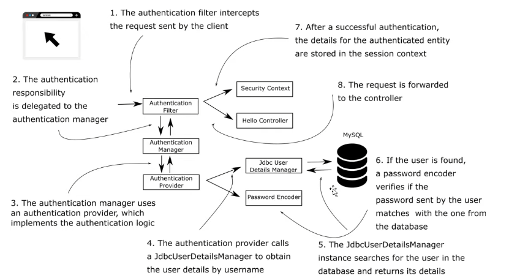
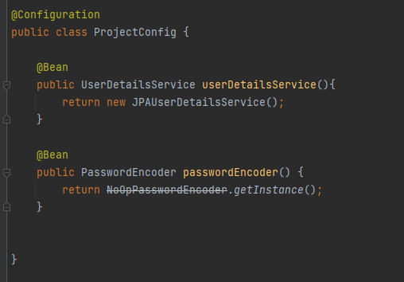
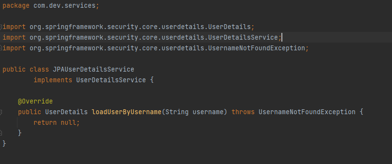
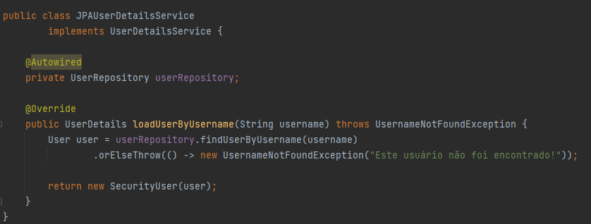
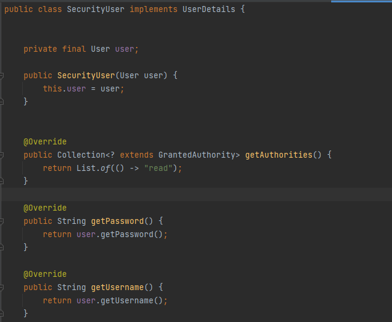
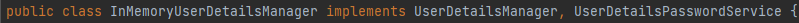

# Implementando a interface UserDetailsService

# Revisão do fluxo:

<ol>
    <li>A requisição é interceptada pelo AuthenticationFilter (que pertence a um filter-chain)</li>
    <li>O AuthFilter delega para o AuthenticationManager que escolhe o AuthenticationProvider</li>
    <li>Escolhido o Provider correto, que implementa a lógica de autenticação (o usuário existe? a senha está correta? etc...)</li>
     <li>O provider usará os objetos PasswordEncoder e alguma implementação de UserDetailsService.</li>
    <li>Caso o usuário atenda aos parâmetros de autenticação, um objeto Authentication é colocado no Security Context e o usuário acessa o endpoint.</li>
</ol>

Neste ponto, vale ressaltar que usaremos nossa própria implementação de UserDetailsService que usará uma base de dados.

Veja o diagrama do que acabou de ser dito (para referência):

## O projeto
As dependências adicionadas neste momento foram Spring Security, Data JPA, Mysql Conn e Web.
Usarenos o JPARepository como padrão para executar e geranciar querys SQL.

Bom, vamos relembrar como podemos fazer a configuração de segurança do projeto:

Aqui, veja que a instância de UserDetailsService será provida por nós e resolvemos chamá-la de JPAUserDetailsService. Além disso o passwordEncoder é um NoOpPasswordEncoder, que usaremos para fins de teste (NUNCA USE ALÉM DISSO). 

Para implementação do loadUserByUsername, fizemos o seguinte:

Existe a nossa classe (entidade) User e uma classe apenas para seguranaça amarrada à entidade User, chamada SecurityUser.
ela extends o usuário que o Spring reconhece, o UserDetails. Veja:

Com isso, já conseguimos autenticar o usuário ainda sem encode de senha, com autenticação HTTP basic.
Um spoiler do próximo projeto é o seguinte: UserDetailsService é uma interface, um contrato, que é reconhecido pelo Spring, e que nos diz como recuperar o usuário, nesse projeto através de uma base de dados.
Porém, existe outra interface (foi colocada na primeira imagem) que é UserDetailsManager, ou seja um geranciador completo de estados do usuario (CRUD).
Nós já usamos uma implementação dela na aula anterior, veja e relembre:

InMemoryUserDetailsManager, como o nome diz, é um Manager de usuário em memória e implementa a UserDetailsManager que por sua vez implementa a UserDetailsService. 