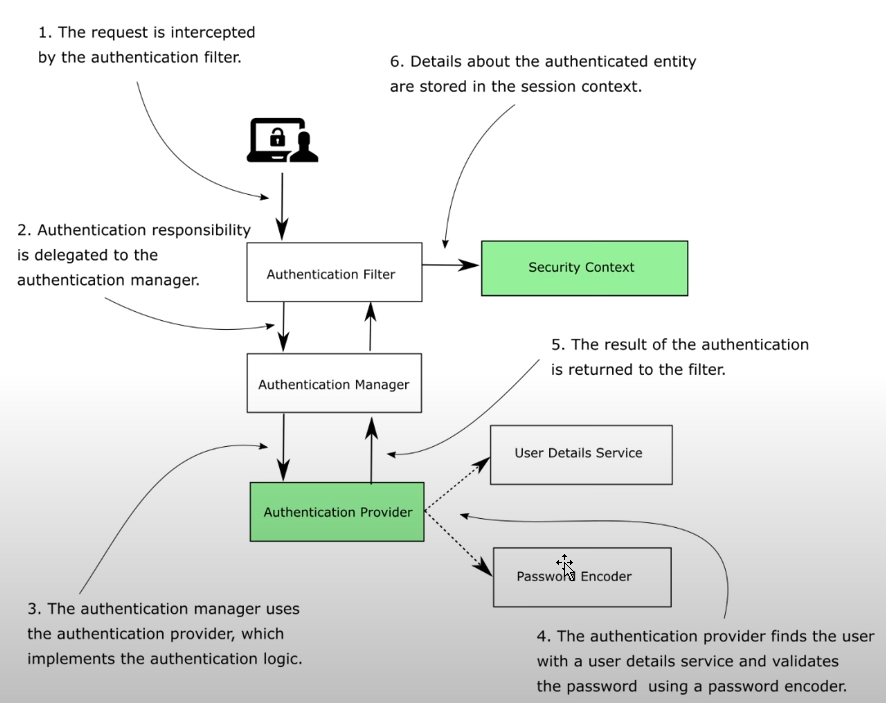
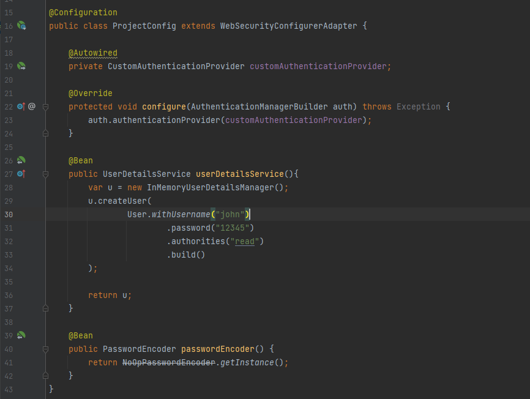
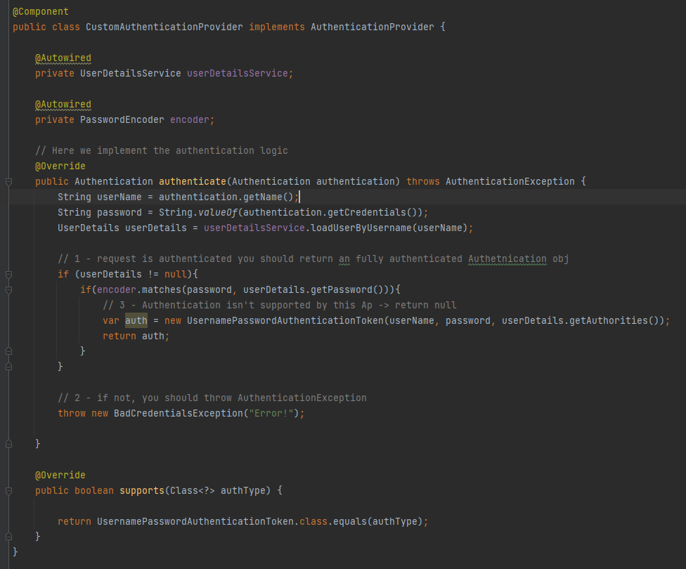

# Aula 04 — AuthenticationProvider

Relembrando o core do funcionamento do Spring Security, temos que a requisição será interceptada por um AuthenticationFilter que delega ao AuthenticationManager  escolher o AuthenticationProvider que fará a autenticação (ou não da requisição).

Nesta etapa, aprendemos um pouco mais sobre o AuthenticationProvider, criando um CustomAuthenticationProvider que será injetado na classe de configuração do projeto:

Primeiramente, implementamos o contrato a ser seguido de forma que o Spring entenda nossa classe:

Dessa forma, precisaremos implementar dois métodos: 
- Authentication authenticate(Authentication authentication)
- boolean supports(Class<?> authType)

O primeiro método deverá retornar um "fully authenticated user" de fato baseado num objeto authentication entregue pelo AuthenticationManager;
Já o segundo, retorna se o tipo de authenticationProvider é suportado ou não.

Veja a implementação que usou o BasicAuthenticationFilter como base (vale lembrar que UsernamePasswordAuthenticationToken extends AbstractAuthenticationToken extends Authentication):

