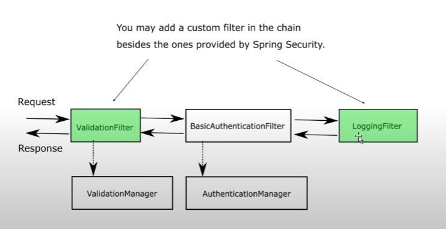
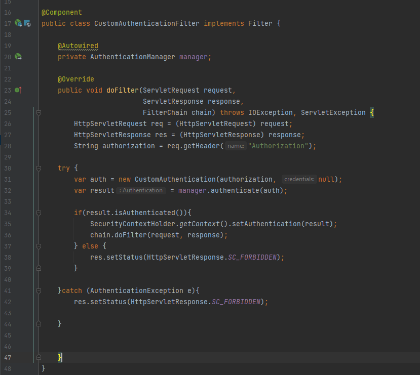
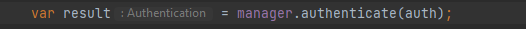
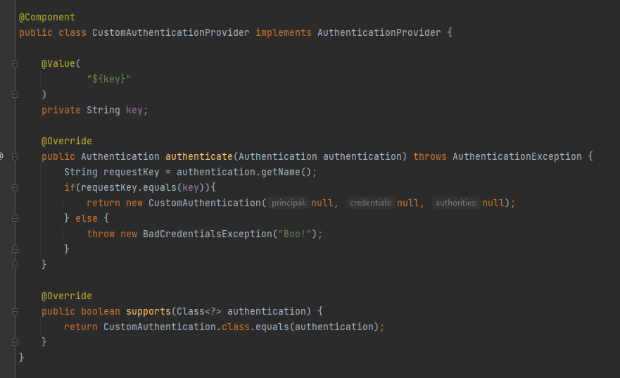
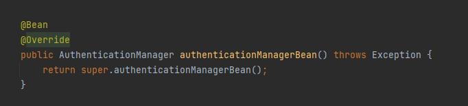
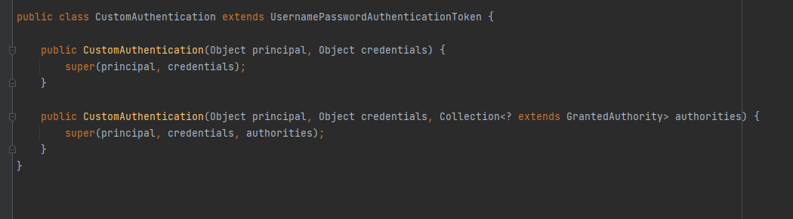
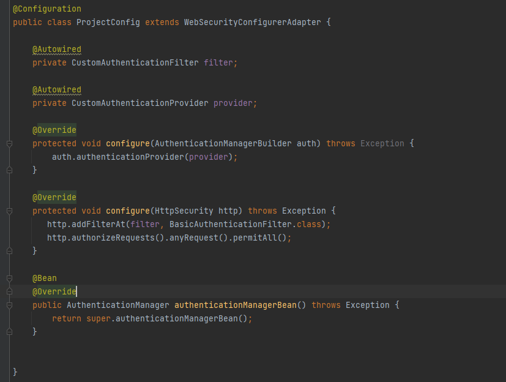

# Aula 05 - FilterChain

Por conveniência, tratamos até então o AuthenticationFilter como sendo apenas um filtro, mas o que de fato ocorre é que a requisição passa por uma lista de filtros, uma cadeira, uma corrente, a filterchain. 

Cada filtro é responsável por uma ação e podemos usá-los a nosso favor para implementações com spring security;

Neste exemplo, usaremos uma autenticação simples que verifica se a request tem um header Authorization definido por nós.

Começamos os trabalhos com a implementação de filter:

Percaba que nós delegamos, conforme mostra nosso fluxo, 
para o AuthenticationManager o nosso authentication montado com o auxílio da requisição

A validação do usuário, neste caso será feita no Provider:

Como é de se esperar, temos que expor um Bean deste tipo no contexto da aplicação:
de forma que seja possível injetá-lo.

Assim sendo, o Provider escrito por nós será ativado pois estamos passando um CustomAuthentication que está da seguinte forma:

Para registrar que estamos usando tudo isso, fazemos da seguinte forma, adicionando o filtro na "posição" do BasicAuthenticationFilter:

